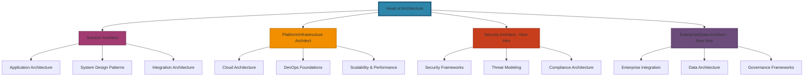
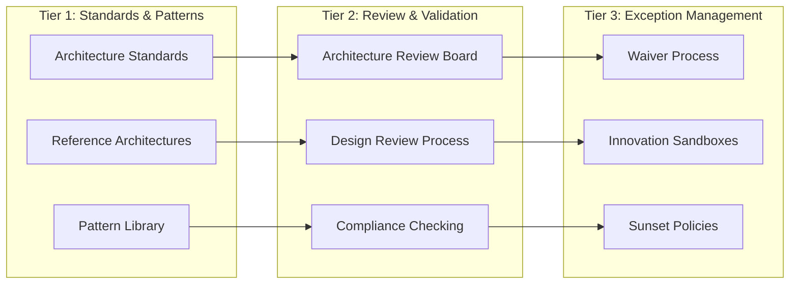
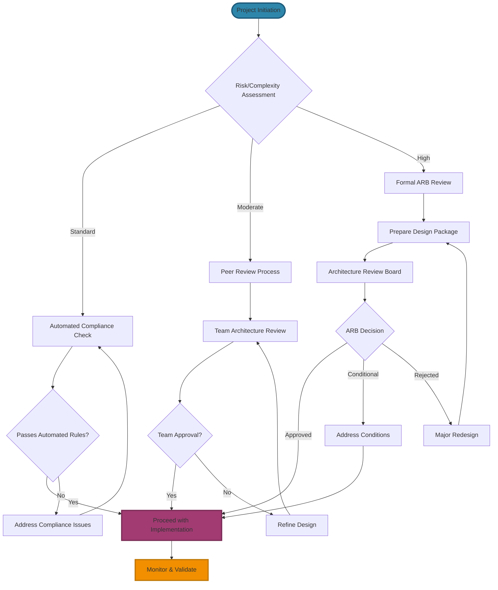
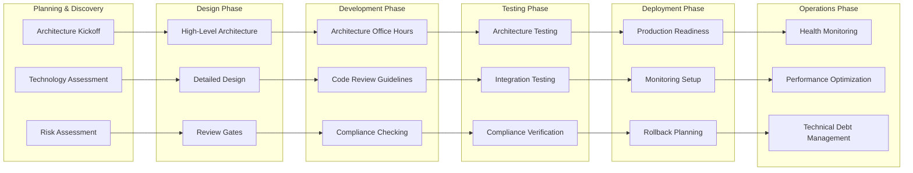
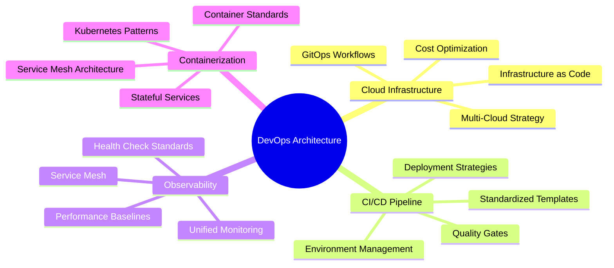
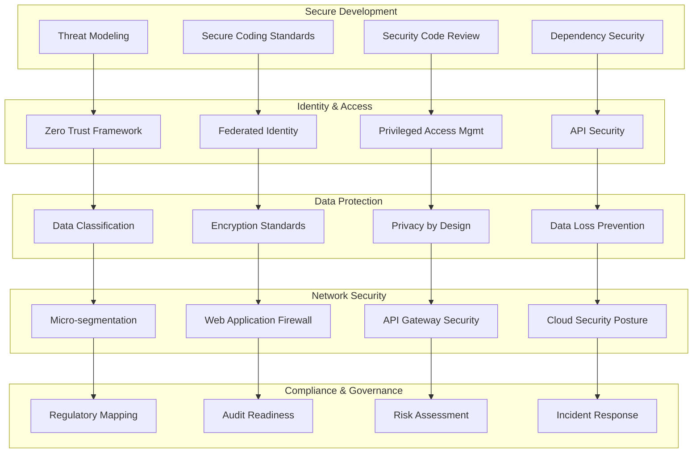
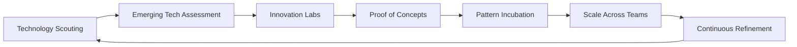
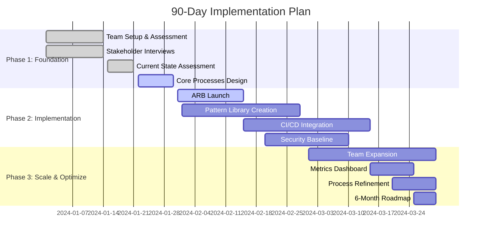

# Architecture Practice Master Plan
## Building a World-Class Architecture Team for 600+ Developers

---

## Executive Summary

This master plan establishes a horizontal architecture team of 5 professionals serving 600 application developers across a sub-legal entity. The approach balances governance with enablement, ensuring consistent, scalable, and secure architecture while maintaining development velocity.

## 1. Strategic Vision & Framework

### Mission
Enable business agility through consistent, scalable, and secure architectural decisions that accelerate innovation while managing technical risk.

### Guiding Principles
- **Enablement over Enforcement**: Architects as trusted advisors, not gatekeepers
- **Progressive Standardization**: Start with guardrails, evolve to patterns
- **Business-Driven Decisions**: Every architectural choice tied to business outcomes
- **Continuous Improvement**: Regularly refine based on feedback and metrics

## 2. Organizational Structure & Team Composition

### Team of 5 Architects



### Team Operating Model
- **Embedding Model**: Each architect embedded with specific business units
- **Central Governance**: Weekly architecture review board
- **Swarm Support**: Cross-team coverage for complex initiatives

## 3. Governance Framework

### Multi-Tier Governance Model



### Governance Mechanisms
- **Architecture Decision Records (ADRs)**: Document all significant decisions
- **Technology Radar**: Quarterly assessment of technology trends
- **Compliance Dashboard**: Real-time visibility into architectural health

## 4. Architecture Review & Approval Workflows

### Three-Tier Review Process



### Review Process SLAs
- **Standard Review**: 5 business days
- **Expedited Review**: 48 hours (emergency only)
- **Consultation**: 24 hours for architectural questions

## 5. SDLC Integration Points

### Architecture Integration Across Software Development Lifecycle



## 6. DevOps Architecture Standards

### Platform Architecture Components



## 7. Security Architecture Framework

### Defense-in-Depth Security Architecture



## 8. Knowledge Management & Documentation Strategy

### Documentation Hierarchy

```mermaid
pyramid
    title Documentation Structure
    "Strategic Architecture<br/>Enterprise level" : 20
    "Solution Patterns<br/>Reusable solutions" : 30
    "Implementation Standards<br/>How-to guides" : 40
    "Decision Records<br/>Historical context" : 10
```

### Knowledge Management Platforms
- **Confluence/Notion**: Central documentation and collaboration
- **Architecture Diagrams**: Structurizr, PlantUML for visual documentation
- **Code Documentation**: Inline architectural guidance
- **Video Library**: Recorded training sessions and presentations

## 9. Metrics & KPI Framework

### Architecture Effectiveness Dashboard

| Metric Category | Key Metrics | Target | Frequency |
|----------------|-------------|--------|-----------|
| **Business Impact** | Time to Market | -15% improvement | Monthly |
| | Production Incidents | -30% reduction | Quarterly |
| | Cost Efficiency | -20% optimization | Quarterly |
| | Developer Productivity | +25% satisfaction | Quarterly |
| **Quality & Compliance** | Architecture Compliance | 90% systems | Monthly |
| | Technical Debt | -40% reduction | Quarterly |
| | Security Posture | Zero critical gaps | Monthly |
| | Performance Baselines | 95% meeting targets | Monthly |
| **Team & Process** | Review Cycle Time | <3 days average | Monthly |
| | Decision Quality | 85% successful | Quarterly |
| | Knowledge Adoption | 80% utilization | Monthly |
| | Team Engagement | 90% satisfaction | Quarterly |

## 10. Communication & Engagement Strategy

### Communication Cadence

```mermaid
gantt
    title Communication Timeline
    dateFormat  YYYY-MM-DD
    section Executive Level
    Quarterly Business Review     :done, exec1, 2024-01-01, 2024-01-31
    Architecture Strategy Session :active, exec2, 2024-04-01, 2024-04-30
    Budget & Resource Planning    :         exec3, 2024-07-01, 2024-07-31

    section Team Leadership
    Monthly Architecture Sync    :done, team1, 2024-01-15, 2024-01-15
    Technology Roadmap Review    :active, team2, 2024-04-15, 2024-04-15
    Process Improvement Workshop :         team3, 2024-07-15, 2024-07-15

    section Development Teams
    Weekly Office Hours          :daily, dev1, 2024-01-01, 2024-12-31
    Monthly Tech Talks           :monthly, dev2, 2024-01-01, 2024-12-31
    Quarterly Architecture Show  :quarterly, dev3, 2024-01-01, 2024-12-31
```

## 11. Continuous Improvement & Innovation

### Innovation Pipeline



### Learning & Development Framework
- **Skill Matrix**: Regular assessment of architectural capabilities
- **Training Programs**: Continuous education for architects and developers
- **Conference Participation**: External learning and networking opportunities
- **Certification Support**: Professional development for architectural skills

## 12. 90-Day Implementation Roadmap

### Phase 1: Foundation Building (Days 1-30)



### Detailed 90-Day Milestones

#### Week 1-2: Team Setup & Assessment
- [ ] Finalize team roles and responsibilities
- [ ] Conduct stakeholder interviews across business units
- [ ] Assess current architectural landscape and pain points
- [ ] Establish communication channels and meeting cadence

#### Week 3-4: Core Processes
- [ ] Design Architecture Review Board charter
- [ ] Create initial Architecture Decision Record template
- [ ] Set up knowledge management platform
- [ ] Define initial technology standards

#### Week 5-6: Governance Launch
- [ ] Launch Architecture Review Board with pilot reviews
- [ ] Deploy first version of architecture compliance checks
- [ ] Create reference architectures for common patterns
- [ ] Establish architecture office hours

#### Week 7-8: Integration & Enablement
- [ ] Integrate architecture gates into CI/CD pipelines
- [ ] Launch architecture documentation site
- [ ] Begin security architecture assessments
- [ ] Start DevOps architecture standards implementation

#### Week 9-10: Team Expansion
- [ ] Recruit and onboard Security Architect
- [ ] Recruit and onboard Enterprise/Data Architect
- [ ] Establish embedded architect model with business units
- [ ] Launch architecture metrics dashboard

#### Week 11-12: Optimization
- [ ] Refine processes based on feedback
- [ ] Scale architecture reviews to all major initiatives
- [ ] Establish quarterly innovation cycles
- [ ] Create 6-month architectural roadmap

#### Week 13: Measurement & Planning
- [ ] Review 90-day outcomes against KPIs
- [ ] Present architecture value to leadership
- [ ] Plan next 90-day improvement cycle
- [ ] Establish annual planning process

## Success Metrics for 90 Days
- 70% of new initiatives following architecture review process
- 15+ documented patterns and reference architectures
- 80% architect engagement satisfaction score
- 20% reduction in architecture-related production issues
- Clear roadmap for next 6 months

## Critical Success Factors

### Immediate Actions (Week 1-2)
1. **Stakeholder Alignment**: Secure executive sponsorship and team buy-in
2. **Quick Wins**: Demonstrate architecture value within first 30 days
3. **Process Foundation**: Establish core team processes and tools
4. **Communication Rhythm**: Create regular cadence with development teams

### Risk Mitigation Strategies
- **Perception as Bureaucracy**: Position architects as enablers, not gatekeepers
- **Resistance to Change**: Early engagement and co-creation with teams
- **Resource Constraints**: Prioritize high-impact architectural activities
- **Scaling Challenges**: Build processes that scale efficiently

### Investment Requirements
- **Tools**: Architecture modeling tools, knowledge management platforms
- **Training**: Continuous education for architects and developers
- **Innovation Time**: Budget for experimentation and pattern development
- **External Expertise**: Consulting for specialized architectural challenges

---

*This comprehensive master plan provides a solid foundation for building a world-class architecture practice that balances governance with enablement, ensuring your 600 developers have the architectural guidance they need while maintaining the agility to innovate and deliver value quickly.*